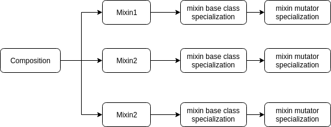
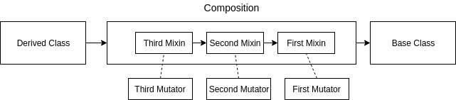

# Lightweight static mixin framework
## Multiple-inheritance based
### Concepts
1. Composition
2. Mixin
3. Mutator (name subject to change!)




### Composition
A composition is an aggregate of mixins
```C++
template <template <typename> class... Ts>
class composition : public Ts<mutator<Ts, Ts...>>...
{
public:
	composition() : Ts<mutator<Ts, Ts...>>()...
	{
	}

	composition(const composition<Ts...>& orig)
	    : Ts<mutator<Ts, Ts...>>(orig)...
	{
	}

	composition(composition<Ts...>&& orig)
	    : Ts<mutator<Ts, Ts...>>(std::move(orig))...
	{
	}

	virtual ~composition() {}
};
```
The constructor of a composition calls the constructors of its constituents.
This is applicable for default constructors, copy constructors, and move constructors.
There is currently no way to supply each mixin with its own parameter list.

### Mixin
A mixin is a piece of functionality.
```C++
template <
    typename M, typename Requirements = TemplateTypes<>,
    typename Friends = TemplateTypes<>>
struct mixin : public M
{
	virtual ~mixin(){};
};
```
Mixins do not know about any other mixins, unless they're in the requirements/friends list.
If a mixin is required in the composition, and isn't available, a compile time error is thrown.

### Mutator
Communication between mixins is done through mutation.
If a mixin A requires a mixin B, then A can mutate to B, and use its interface.
Mutators know about the full type of the composition, and hence can provide this service. 
They also ensure encapsulation; that is, they ensure that the mixins don't know about any non-required/non-friend mixin in the composition.
```C++
template <template <typename> class U, template <typename> class... Ts>
struct mutator
{
private:
	using mixin_list_t = Types<Ts<empty_mutator>...>;
	using composition_t = composition<Ts...>;
	using friends_t =
	    typename U<empty_mutator>::friends::template ToTypes<empty_mutator>;
	using requirements_t = typename U<
	    empty_mutator>::requirements::template ToTypes<empty_mutator>;

	// throw compilation error if not all requirements are met
	static constexpr bool is_valid =
	    mixin_list_t::template has_types<requirements_t>::value;
	using check = std::enable_if_t<is_valid>;

	template <template <typename> class I>
	static constexpr bool has_type =
	    mixin_list_t::template has_v<I<empty_mutator>>;
	template <template <typename> class I>
	static constexpr bool is_friend =
	    friends_t::template has_v<I<empty_mutator>>;
	template <template <typename> class I>
	static constexpr bool does_require =
	    requirements_t::template has_v<I<empty_mutator>>;

	// generate mutator type for mixin
	template <template <typename> class I>
	using mutator_t = mutator<I, Ts...>;
	// generate full mixin type
	template <template <typename> class I>
	using mixin_t = I<mutator_t<I>>;

public:
	template <template <typename> class I>
	using friend_t = std::enable_if_t<
	    is_friend<I>, std::conditional_t<has_type<I>, mixin_t<I>, None>>;

	template <template <typename> class I>
	using requirement_t = std::enable_if_t<does_require<I>, mixin_t<I>>;

	template <template <typename> class I>
	requirement_t<I>& mutate()
	{
		auto most_derived = static_cast<composition_t*>(this);
		return static_cast<mixin_t<I>&>(*most_derived);
	}

	virtual ~mutator()
	{
	}
};
```
It might be the case that the public interface isn't enough for communication. This is solved by friendship. Since the mixin can't know about the full type of its friends, it uses the mutator to also provide this information.
```C++
template <typename M>
class A : public mixin<M, requires<>, friends_with<B>> {
    friend typename M::template friend_t<B>;
    // more code
};
```
Note that friends don't have to be in the composition.

### Examples
An example is provided in the repo.

## Single-inheritance based
### Possible problems with previous implementation
The multi-inheritance nature of the previous paradigm makes it not suitable for derived classes down the inheritance hierarchy.
A possible solution is to flatten it, so that each mixin inherits from another mixin instead of inheriting from the mutator. 
The mutator will be nowhere in the inheritance hierarchy, however, mutator services can still be supplied by making the mutate function static. Something alnog the lines of
```C++
template <typename NextMixin, typename Mutator>
struct HumanMixin : public NextMixin
{
	using requirements = TemplateTypes</*required mixins*/>;
	using friends = TemplateTypes</*friend mixins*/>;
	// your mixin implementation
};
```
where the first "NextMixin" will be the required parent class.
A type function can then create the required composition
```
Composition_{n} = Mixin_{n}<Composition_{n_1}, Mutator_{n}>
Composition_{n_1} = Mixin_{n_1}<Composition_{n_2}, Mutator_{n-1}>
...
Composition_{0} = BaseClass
```



### Implementation
Not ready yet!

### References
This was inspired by [this talk](https://www.youtube.com/watch?v=wWZi_wPyVvs).